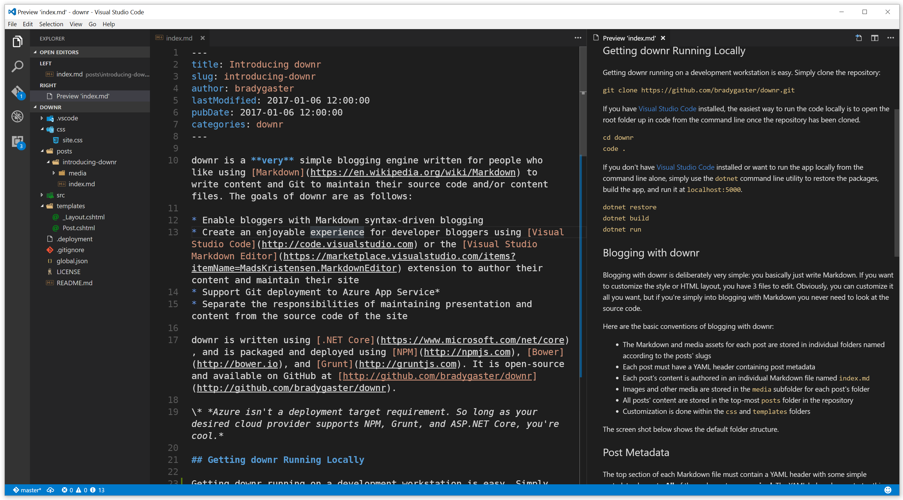

downr is a **very** simple blogging engine written for people who like using [Markdown](https://en.wikipedia.org/wiki/Markdown) to write content and Git to maintain their source code and/or content files. The goals of downr are as follows:

* Enable bloggers with Markdown syntax-driven blogging
* Create an enjoyable experience for developer bloggers using [Visual Studio Code](http://code.visualstudio.com) or the [Visual Studio Markdown Editor](https://marketplace.visualstudio.com/items?itemName=MadsKristensen.MarkdownEditor) extension to author their content and maintain their site
* Support Git deployment to Azure App Service*
* Separate the responsibilities of maintaining presentation and content from the source code of the site

downr is written using [.NET Core](https://www.microsoft.com/net/core), and is packaged and deployed using [NPM](http://npmjs.com), [Bower](http://bower.io), and [Grunt](http://gruntjs.com). It is open-source and available on GitHub at [http://github.com/bradygaster/downr](http://github.com/bradygaster/downr). 

\* *Azure isn't a deployment target requirement. So long as your desired cloud provider supports NPM, Grunt, and ASP.NET Core, you're cool.*

## Getting downr Running Locally

Getting downr running on a development workstation is easy. Simply clone the repository:

    git clone https://github.com/bradygaster/downr.git

If you have [Visual Studio Code](http://code.visualstudio.com) installed, the easiest way to run the code locally is to open the root folder up in code from the command line once the repository has been cloned. 

    cd downr
    code .

If you don't have [Visual Studio Code](http://code.visualstudio.com) installed or want to run the app locally from the command line alone, simply use the `dotnet` command line utility to restore the packages, build the app, and run it at `localhost:5000`. 

    dotnet restore
    dotnet build
    dotnet run

## Blogging with downr

Blogging with downr is deliberately very simple: you basically just write Markdown. If you want to customize the style or HTML layout, you have 3 files to edit. Obviously, you can customize it all you want, but if you're simply into blogging with Markdown you never need to look at the source code. 

Here are the basic conventions of blogging with downr:

* The Markdown and media assets for each post are stored in individual folders named according to the posts' slugs
* Each post must have a YAML header containing post metadata
* Each post's content is authored in an individual Markdown file named `index.md`
* Images and other media are stored in the `media` subfolder for each post's folder
* All posts' content are stored in the top-most `posts` folder in the repository
* Customization is done within the `css` and `templates` folders 

The screen shot below shows the default folder structure. 

## Post Metadata

The top section of each Markdown file must contain a YAML header with some simple metadata elements. **All** of these elements are **required**. The YAML below demonstrates this convention. 

    ---
    title: Introducing downr
    slug: introducing-downr
    author: bradygaster
    lastModified: 2017-01-06 12:00:00
    pubDate: 2017-01-06 12:00:00
    categories: downr
    ---

## Image Pathing

As demonstrated by this file earlier, the path you'd use to link to images should be `media/[filename]`. At run-time, the `src` attributes for each image in your posts will be fixed automatically. This enables you to edit and preview your content in [Visual Studio Code](http://code.visualstudio.com) in exactly the same way it'll be rendered once you publish your blog. 

## Contributing

Contributions to downr are welcome and encouraged. Fork the [downr GitHub repository](http://github.com/bradygaster/downr) and submit pull requests to your heart's content. 