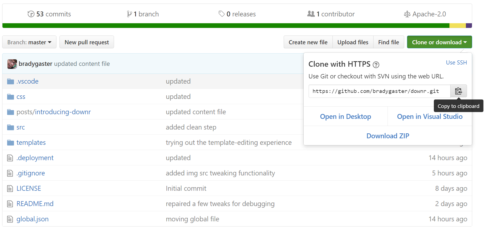
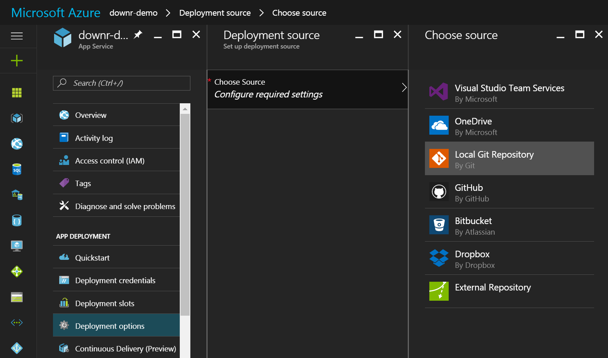
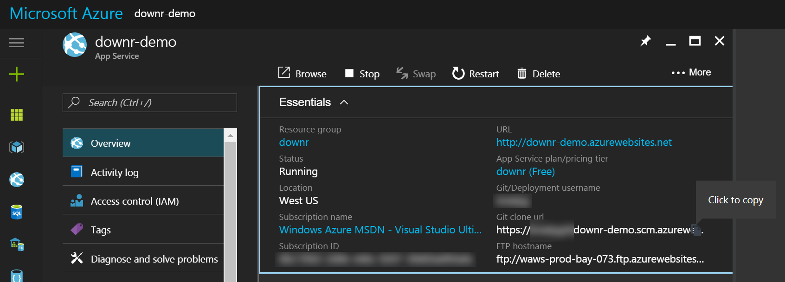
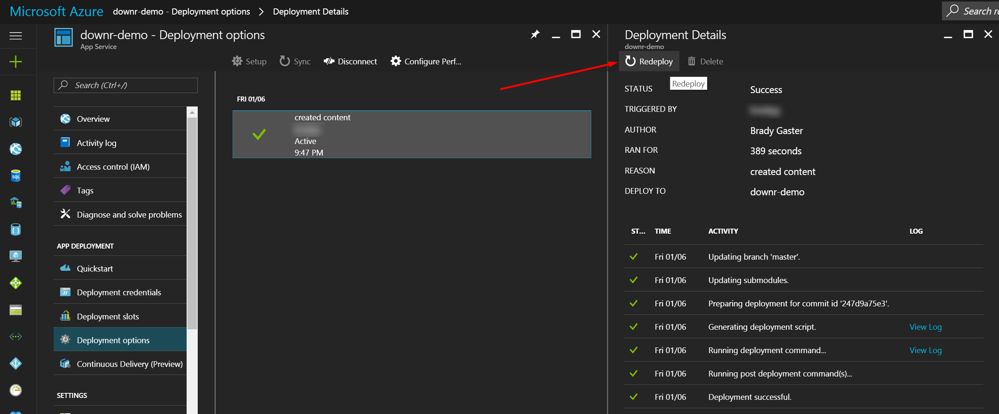

downr is a **very** simple blogging engine written for people who like using [Markdown](https://en.wikipedia.org/wiki/Markdown) to write content and Git to maintain their source code and/or content files. The goals of downr are as follows:

* Enable bloggers with Markdown syntax-driven blogging
* Create an enjoyable experience for developer bloggers using [Visual Studio Code](http://code.visualstudio.com) or the [Visual Studio Markdown Editor](https://marketplace.visualstudio.com/items?itemName=MadsKristensen.MarkdownEditor) extension to author their content and maintain their site
* Support Git deployment to Azure App Service*
* Separate the responsibilities of maintaining presentation and content from the source code of the site

downr is written using [.NET Core](https://www.microsoft.com/net/core), and is packaged and deployed using [NPM](http://npmjs.com), [Bower](http://bower.io), and [Grunt](http://gruntjs.com). It is open-source and available on GitHub at [http://github.com/bradygaster/downr](http://github.com/bradygaster/downr). 

\* *Azure isn't a deployment target requirement. So long as your desired cloud provider supports NPM, Grunt, and ASP.NET Core, you're cool.*

## Getting downr Running Locally

Getting downr running on a development workstation is easy. The project is open source and available on GitHub. 

Simply clone the repository:

    git clone https://github.com/bradygaster/downr.git

If you have [Visual Studio Code](http://code.visualstudio.com) installed, the easiest way to run the code locally is to open the root folder up in code from the command line once the repository has been cloned. 

    cd downr
    code .

If you don't have [Visual Studio Code](http://code.visualstudio.com) installed or want to run the app locally from the command line alone, simply use the `dotnet` command line utility to restore the packages, build the app, and run it at `localhost:5000`. 

    dotnet restore
    dotnet build
    dotnet run

## Blogging with downr

Blogging with downr is deliberately very simple: you basically just write Markdown. If you want to customize the style or HTML layout, you have 3 files to edit. Obviously, you can customize it all you want, but if you're simply into blogging with Markdown you never need to look at the source code. 

Here are the basic conventions of blogging with downr:

* The Markdown and media assets for each post are stored in individual folders named according to the posts' slugs
* Each post must have a YAML header containing post metadata
* Each post's content is authored in an individual Markdown file named `index.md`
* Images and other media are stored in the `media` subfolder for each post's folder
* All posts' content are stored in the top-most `posts` folder in the repository
* Customization is done within the `css` and `templates` folders 

The screen shot below shows the default folder structure. 

## Post Metadata

The top section of each Markdown file must contain a YAML header with some simple metadata elements. **All** of these elements are **required**. The YAML below demonstrates this convention. 

    ---
    title: Introducing downr
    slug: introducing-downr
    author: bradygaster
    lastModified: 2017-01-06 12:00:00
    pubDate: 2017-01-06 12:00:00
    categories: downr
    ---

## Image Path Fix-ups

As demonstrated by this file earlier, the path you'd use to link to images should be `media/[filename]`. At run-time, the `src` attributes for each image in your posts will be fixed automatically. This enables you to edit and preview your content in [Visual Studio Code](http://code.visualstudio.com) in exactly the same way it'll be rendered once you publish your blog. 

Note how the Markdown source code links to the relative path of the image in the `media` subfolder, but in the Chrome F12 tools in the top pane of the screenshot the image path is fixed up to be relative to the site's root at `/posts/introducing-downr/media/folder-structure.png`. 

## Project Details

downr was created using a collection of open-source web frameworks and tools. Here's a quick synopsis of the project's architecture. 

* Initial project structure created using [Yeoman's](http://yeoman.io/) `yo aspnet` template. 
* NuGet dependencies:
    * [Markdig](https://github.com/lunet-io/markdig) is used for Markdown-to-HTML conversion
    * [YamlDotNet](http://aaubry.net/pages/yamldotnet.html) is used to parse the YAML headers in post Markdown files
    * The [HTML Agility Pack for .NET Core](https://github.com/zulfahmi93/HtmlAgilityPack.NetCore) is used for the image path fix-ups
* Grunt is used to perform the build, during which:
    * The `site.css` is cleared and restored from the root `css` folder content
    * The `posts` folder from the `wwwroot` folder is deleted and restored from the root's `posts` folder. The root `posts` folder is where bloggers should commit Markdown content. 
    * The Razor templates from the `templates` folder in the project root are copiled into the `src\Views` folder prior to compilation 
* Bower is used to install the client-side JavaScript resources, specifically, Bootstrap, as this is used for the client-side experience construction
* Obviously, NPM is being used to install the build resources

## Publishing to Azure

Included in the source code is an Azure Kudu deployment script (a `.deployment` file). You can learn more about these files on the [Kudu Wiki](https://github.com/projectkudu/kudu/wiki/Custom-Deployment-Script). This file specifies the `src` folder as the project folder. 

Getting started with downr running on Azure App Service is relatively easy:

1. Fork the GitHub repository
1. Clone your fork
1. Create a new Web App using the Azure portal
1. Enable local Git repository publishing via the Azure portal

    

1. Copy the Web App's Git repository URL to your clipboard

    

1. Use the copied URL as the URL of a new remote for your site's local repository

        git remote add azure [your copied url]

1. Add or edit posts in the `posts` folder, and customize your style via the root `css` folder. If you need to change the layout or want to customize the navbar or sidebar edit the `.cshtml` files in the `templates` folder. 
1. Commit your files to your local Git repository and then push them to your azure remote 

        git add .
        git commit -m 'added content or customized style'
        git push azure master

1. Once the publish completes you should see new content 

**Note**: In some cases, the very first publish to Azure fails to copy the content and style files. If this happens or you see something unexpected, use the Azure portal to redeploy your previous deployment. The screenshot below demonstrates how you can re-deploy your initial publish with one click in the portal. 

## Contributing

Contributions to downr are welcome and encouraged. Fork the [downr GitHub repository](http://github.com/bradygaster/downr) and submit pull requests to your heart's content. 

### Naming Disclaimer
*Note: Product naming is difficult. I noticed that there were a few other projects out there [named](https://github.com/duhruh/Downr) [similarly](https://downr.codeplex.com/) to this one. The dotnet markdown blogging tool known as downr has no implied or accidental relationship to any of these other awesome projects.*